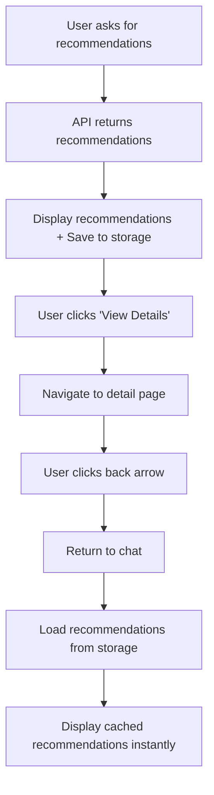

# Recommendation Storage Feature

## 🎯 **Overview**

The recommendation storage feature automatically saves and restores recommendation data using browser localStorage, allowing users to navigate to recommendation detail pages and return to the chat without losing their recommendations or needing to make new API requests.

## ✨ **Key Benefits**

- **Seamless Navigation**: Users can view recommendation details and return without losing data
- **Performance Improvement**: Eliminates unnecessary API re-requests
- **Better UX**: Instant restoration of recommendations when returning to chat
- **Data Persistence**: Recommendations survive page refreshes (24-hour expiration)
- **Memory Management**: Automatic cleanup when conversations are deleted

## 🔧 **Technical Implementation**

### **Storage Architecture**

#### **Storage Location**: Browser localStorage
- **Key Format**: `tastetrip_recommendations_{conversationId}`
- **Data Structure**:
```javascript
{
  recommendations: Recommendation[],
  timestamp: number,
  conversationId: string
}
```

#### **Expiration**: 24 hours (automatic cleanup)
#### **Scope**: Per conversation (isolated data)

### **Core Functions**

#### **1. Save Recommendations**
```typescript
saveRecommendationsToStorage(recommendations: Recommendation[], conversationId: string)
```
- **When**: Automatically when new recommendations are received from API
- **Where**: `ChatInterface.tsx` → recommendation response processing
- **Storage**: localStorage with timestamp and conversation ID

#### **2. Load Recommendations**
```typescript
loadRecommendationsFromStorage(conversationId: string): Recommendation[] | null
```
- **When**: Component mount when fetching conversation messages
- **Where**: `ChatInterface.tsx` → `fetchMessages()` function
- **Validation**: Checks expiration (24 hours) and data integrity

#### **3. Clear Recommendations**
```typescript
clearRecommendationsFromStorage(conversationId?: string)
```
- **When**: Conversation deletion or manual cleanup
- **Scope**: Single conversation or all stored recommendations
- **Where**: Both `ChatInterface.tsx` and `chat/page.tsx` deletion handlers

## 🔄 **User Flow**

### **Typical Usage Scenario:**

1. **User gets recommendations**:
   ```
   User: "sushi places"
   → AI processes request
   → Backend returns recommendations
   → Recommendations displayed + saved to storage
   ```

2. **User views details**:
   ```
   User clicks "View Details" on recommendation
   → Navigates to /recommendation/[entity_id]
   → Views map, photos, details, directions
   ```

3. **User returns to chat**:
   ```
   User clicks back arrow
   → Returns to chat interface
   → Recommendations automatically restored from storage
   → No API re-request needed ✨
   ```

## 🛠 **Implementation Details**

### **Files Modified**

#### **1. ChatContext (`frontend/src/context/ChatContext.tsx`)**
- **Added Interface Methods**:
  - `saveRecommendationsToStorage`
  - `loadRecommendationsFromStorage` 
  - `clearRecommendationsFromStorage`

- **Features**:
  - Data validation and error handling
  - Timestamp-based expiration (24 hours)
  - Comprehensive logging for debugging
  - Memory cleanup prevention

#### **2. ChatInterface (`frontend/src/components/ChatInterface.tsx`)**
- **Auto-Save**: Recommendations saved when received from API
- **Auto-Load**: Stored recommendations loaded on component mount
- **Auto-Clear**: Storage cleared when conversation deleted

#### **3. Chat Page (`frontend/src/app/chat/page.tsx`)**
- **Cleanup**: Storage cleared when conversations deleted from list

### **Data Flow**



## 📊 **Storage Management**

### **Automatic Expiration**
- **Duration**: 24 hours from creation
- **Check**: Every load operation validates timestamp
- **Cleanup**: Expired data automatically removed

### **Storage Limits**
- **Browser Limit**: ~5-10MB per domain (browser dependent)
- **Estimated Usage**: ~1-5KB per conversation with recommendations
- **Capacity**: Thousands of conversations before hitting limits

### **Memory Management**
- **Conversation Deletion**: Automatically clears associated storage
- **Bulk Cleanup**: Option to clear all stored recommendations
- **Error Handling**: Graceful fallback if localStorage unavailable

## 🔍 **Debugging & Monitoring**

### **Console Logs**
```javascript
// Storage operations
💾 Saved recommendations to storage: {conversationId, count, key}
📚 Loaded recommendations from storage: {conversationId, count, age}
🗑️ Cleared recommendations for conversation: conversationId

// Data validation
📭 No stored recommendations found for conversation: conversationId
⏰ Stored recommendations expired, removing: conversationId

// Error handling
❌ Failed to save recommendations to storage: error
❌ Failed to load recommendations from storage: error
```

### **Browser DevTools**
- **Location**: Application → Storage → Local Storage
- **Key Pattern**: `tastetrip_recommendations_*`
- **Data Inspection**: JSON structure with recommendations and metadata

## ⚙️ **Configuration**

### **Expiration Time**
```javascript
const maxAge = 24 * 60 * 60 * 1000; // 24 hours in milliseconds
```
*Can be adjusted in ChatContext.tsx*

### **Storage Key Prefix**
```javascript
const storageKey = `tastetrip_recommendations_${conversationId}`;
```
*Consistent naming for easy identification*

## 🚨 **Error Handling**

### **Storage Unavailable**
- **Scenario**: localStorage disabled or quota exceeded
- **Behavior**: Graceful fallback, feature disabled, no errors thrown
- **UX Impact**: Recommendations work normally, just no persistence

### **Data Corruption**
- **Scenario**: Invalid JSON or malformed data in storage
- **Behavior**: Automatic cleanup, fresh API request
- **Recovery**: Seamless user experience, no disruption

### **Expired Data**
- **Scenario**: User returns after 24+ hours
- **Behavior**: Expired data removed, new API request made
- **UX**: Normal recommendation flow, slight delay acceptable

## 🎯 **Future Enhancements**

### **Potential Improvements**
1. **Smart Prefetching**: Pre-load recommendations for related queries
2. **Compression**: Reduce storage size for large recommendation sets
3. **Selective Storage**: Only store essential recommendation data
4. **Cross-Tab Sync**: Share recommendations between browser tabs
5. **Offline Support**: Enhanced offline capability with stored data

### **Analytics Integration**
- Track storage hit/miss rates
- Monitor storage usage patterns
- Measure performance improvements

---

**Status**: ✅ **IMPLEMENTED** - Users can now navigate to recommendation details and return without losing their recommendations! 