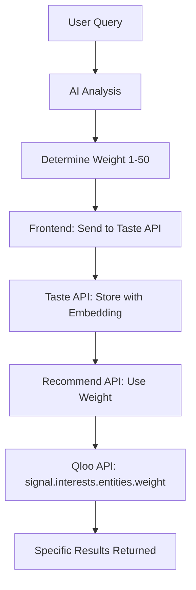

# Weight Parameter System for Recommendation Specificity

## 🎯 **Overview**

The Weight Parameter System introduces intelligent control over recommendation specificity using Qloo's `signal.interests.entities.weight` parameter. This allows the AI to provide more relevant results based on how specific or general the user's request is.

## ✨ **Key Benefits**

- **🎯 Intelligent Specificity**: Automatically adjusts recommendation focus based on query detail
- **🔍 Better Relevance**: More specific queries get more targeted results
- **🌍 Flexible Search**: General queries still get broad, diverse recommendations
- **📊 Qloo Integration**: Leverages Qloo's native weight system for optimal results
- **🤖 AI-Driven**: Weight automatically determined by AI based on query context

## 🔧 **Technical Implementation**

### **Weight Ranges & Effects**

| Weight Range | Query Type | Example | Effect |
|-------------|------------|---------|---------|
| **1-10** | General/Broad | "restaurants" | Wide variety, diverse results |
| **11-30** | Moderately Specific | "Italian restaurants" | Focused but still varied |
| **31-50** | Very Specific | "authentic Italian restaurants in downtown" | Highly targeted, precise results |

### **Implementation Flow**



### **Code Implementation**

#### **1. Frontend AI Response (`systemPrompt.ts`)**
```typescript
{
  "message": "Here are your recommendations for authentic Italian restaurants in downtown Manhattan!",
  "action": {
    "toolcall": "recommend",
    "recommendQuery": "authentic Italian restaurants in downtown Manhattan",
    "weight": 45  // High specificity for detailed query
  }
}
```

#### **2. Frontend Processing (`ChatInterface.tsx`)**
```typescript
const weight = parsedData.action.weight || 10; // Default weight
const payload = { input: recommendQuery, weight: weight };
```

#### **3. Backend Taste API (`tasteController.js`)**
```javascript
const { input, weight } = req.body;
return res.json({ embedding_id, weight: weight || 10 });
```

#### **4. Backend Recommend API (`recommendationController.js`)**
```javascript
const { embedding_id, weight } = req.body;
const signalWeight = weight || 10;

const params = {
  'filter.type': `urn:entity:${entityType}`,
  'signal.interests.entities': entityIds.join(','),
  'signal.interests.entities.weight': signalWeight, // Qloo weight parameter
  'take': 50
};
```

## 🎯 **Use Cases & Examples**

### **Low Specificity (Weight 1-10)**
**User Query**: "I want to travel somewhere"
- **Weight**: 5
- **Effect**: Broad destination recommendations
- **Results**: Mix of cities, countries, regions worldwide

### **Medium Specificity (Weight 11-30)**
**User Query**: "I want Italian restaurants"
- **Weight**: 20
- **Effect**: Focused on Italian cuisine
- **Results**: Italian restaurants with some variety in style/price

### **High Specificity (Weight 31-50)**
**User Query**: "I want authentic Italian restaurants in downtown Manhattan with outdoor seating"
- **Weight**: 45
- **Effect**: Highly targeted results
- **Results**: Specific Italian restaurants matching exact criteria

## 📊 **Qloo API Integration**

### **Parameter Details**
- **Parameter**: `signal.interests.entities.weight`
- **Type**: Integer
- **Range**: 1-50 (relative weights)
- **Purpose**: Controls how heavily entities influence affinity scores

### **Qloo Documentation Reference**
According to Qloo API docs:
> "Weights must be greater than 0 and are relative. A weight of 25 means that entity will more heavily influence affinity scores than a weight of 10."

### **API Call Example**
```javascript
// Qloo API request with weight
const params = {
  'filter.type': 'urn:entity:place',
  'signal.interests.entities': 'urn:entity:place:restaurant1,urn:entity:place:restaurant2',
  'signal.interests.entities.weight': 25, // Moderate specificity
  'take': 50
};
```

## 🔍 **Debugging & Monitoring**

### **Console Logs**
```javascript
// Frontend logs
⚖️ Weight from taste response: 25

// Backend logs  
⚖️ Using signal weight for Qloo API: 25
```

### **Testing Scenarios**
1. **General Query**: "restaurants" → Weight: 5-10
2. **Specific Cuisine**: "sushi places" → Weight: 15-25
3. **Very Specific**: "authentic Japanese sushi in downtown" → Weight: 35-50

## 🚀 **Performance Impact**

### **Benefits**
- **🎯 Better Relevance**: Higher weight queries get more targeted results
- **⚡ Faster Discovery**: Users find relevant results quicker
- **🔄 Reduced Iteration**: Less need for follow-up queries
- **📈 User Satisfaction**: More accurate recommendations

### **Considerations**
- **Weight Range**: 1-50 provides good granularity without overwhelming
- **Default Fallback**: Weight 10 ensures reasonable results even without AI determination
- **Qloo Limits**: Weight parameter doesn't affect API rate limits

## 🔮 **Future Enhancements**

### **Potential Improvements**
1. **Dynamic Weight Adjustment**: Learn from user feedback to adjust weights
2. **Contextual Weighting**: Consider user history and preferences
3. **Multi-Weight Support**: Different weights for different entity types
4. **A/B Testing**: Compare different weight strategies for optimization

### **Analytics Integration**
- Track weight usage patterns
- Measure recommendation success rates by weight
- Optimize weight ranges based on user behavior

## 📋 **Testing Checklist**

### **Weight Range Testing**
- [ ] Test weight 1-10: General queries
- [ ] Test weight 11-30: Moderate specificity
- [ ] Test weight 31-50: High specificity
- [ ] Test missing weight: Default to 10

### **Query Type Testing**
- [ ] "restaurants" → Low weight
- [ ] "Italian restaurants" → Medium weight
- [ ] "authentic Italian restaurants downtown" → High weight
- [ ] "travel destinations" → Low weight
- [ ] "beach destinations in Europe" → Medium weight

### **Integration Testing**
- [ ] Frontend weight extraction
- [ ] Backend weight processing
- [ ] Qloo API weight parameter
- [ ] Result relevance validation

---

**Status**: ✅ **IMPLEMENTED** - Weight parameter system is now active and controlling recommendation specificity through Qloo API integration! 